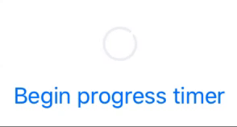

# SwiftUIDownloadView



SwiftUIDownloadView provides a download progress view written completely in SwiftUI the new framework introduced by Apple.

  - Loading animation when the connection is being established
  - Download progress
  - Tap to cancel action

**Usage**

```sh
SwiftUIDownloadView(progress: Float, action: () -> Void)
```
Just initialise by providing progress and a closure to handle the cancel action and place it as your List's item or as a subview.

The progress uodates when the @ObjectBinding of your ContentView and the progress updates.

See the example for more details.

Contributions are welcome.
